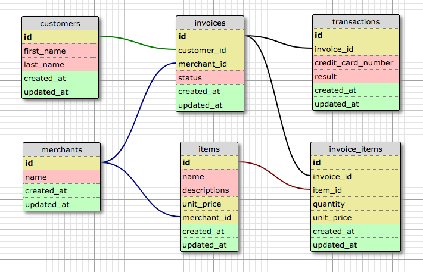

# Rails Engine

The Rails Engine is an API server to interact with and retrieve data for an online merchant shop. The data includes information about items, merchants, customers, and transactions/ invoices.

The endpoints for interacting with the API are located [here](./readme/endpoints.md).

The application is also hosted on [Heroku](http://rails-engine-1801.herokuapp.com/api/v1/merchants).

## Table of Contents
- [Installation Instructions](#installation-instructions)
- [Database Schema](#database-schema)
- [Running Tests](#running-tests)
- [Authors](#authors)

### Installation Instructions

Clone this repository into your machine using the following command:
```ruby
git clone git@github.com:kolyaventuri/rails_engine.git
```

Switch into the directory ```rails_engine``` and run bundle as follows:
```ruby
bundle
```

Setup the database by running the following commands:
```ruby
rake db:{create, migrate}
rake import:all
```

To view the app on localhost, start the server by entering the following command in your terminal:
```ruby
rails s
```

Open up a browser window and then visit any of the specified [endpoints](./readme/endpoints.md).

### Database schema

